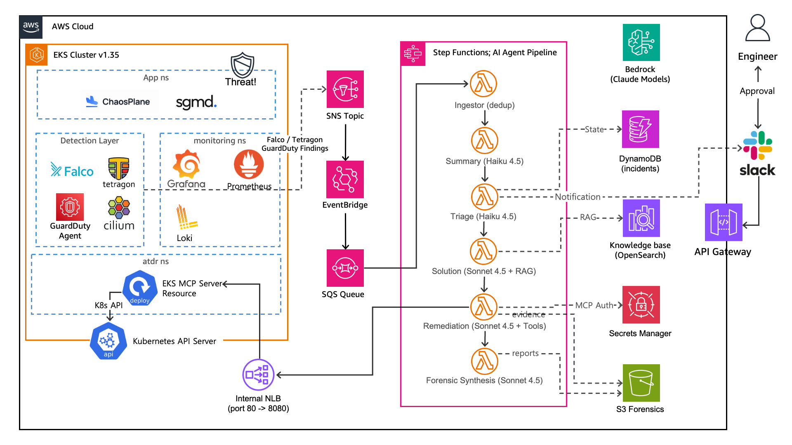

# ATDR; AI Threat Detection and Response for EKS

Amazon EKS 환경에서 보안 위협을 실시간으로 탐지하고, AI Agent Chain을 통해 분석 및 대응하는 아키텍처입니다.

## Architecture


3중 탐지(Falco + Tetragon + GuardDuty) → AI 4단계 분석(Summary → Triage → Solution → Remediation) → 자동 대응(Pod 격리, SIGKILL, NetworkPolicy) + Human Approval via Slack.

## Quick Start

### Prerequisites

- AWS CLI v2 + credentials configured
- Terraform >= 1.10.0
- kubectl >= 1.35
- Helm >= 3.x
- Python 3.12
- make

### 1. Bootstrap (최초 1회)

```bash
./init.sh
```

S3 backend 버킷을 생성하고 terraform init을 실행.

### 2. Infrastructure Up

```bash
make infra-up
```

Terraform으로 전체 AWS 인프라를 생성:
- VPC (2-AZ, public/private subnets, NAT GW)
- EKS 클러스터 (v1.35, t3.large + c5.large 노드)
- IAM 역할 (EKS, Lambda, Step Functions, Pod Identity)
- GuardDuty + Security Hub + EventBridge
- SNS/SQS + DLQ
- Lambda func 6개 + Step Functions Workflow
- API Gateway (Slack Bot)
- OpenSearch Serverless (Knowledge Base)
- KMS + S3 (runbooks, forensics, logs)
- DynamoDB (incidents, approval-audit)
- Secrets Manager

약 15-20분 소요. 완료 후 kubeconfig가 자동 설정됨.

### 3. Secrets 설정

```bash
make secrets
```

위 명령어를 통해 Slack Bot Token, Signing Secret, MCP Token을 설정한다.

Slack App은 [api.slack.com](https://api.slack.com/apps)에서 먼저 생성해야 한다:
- Bot Token Scopes: `chat:write`, `commands`, `incoming-webhook`
- Event Subscriptions URL: `<slack_api_endpoint>/slack/events`
- Interactivity URL: `<slack_api_endpoint>/slack/interactions`
- Slash Commands: `/atdr`

`slack_api_endpoint`는 `make infra-up` 출력에서 확인할 수 있다.

### 4. Platform Up (Kubernetes 컴포넌트)

```bash
make platform-up
```

Helm으로 보안/관측 스택을 배포한다:
- AWS Load Balancer Controller
- Cilium + Hubble
- Falco + custom rules
- Tetragon + TracingPolicies
- EKS MCP Server
- kube-prometheus-stack (Prometheus + Grafana + Alertmanager)
- Loki
- External Secrets Operator
- ValidatingAdmissionPolicy

약 10-15분 소요. Docker daemon이 실행 중이어야 EKS MCP 이미지를 빌드/푸시할 수 있다.

### 5. Lambda 코드 배포

```bash
make deploy-lambdas
```

실제 Agent 코드를 Lambda에 업로드한다.

### 6. 검증

```bash
make status
```

## 전체 배포 (한 번에)

```bash
./init.sh              # 최초 1회
make all-up            # infra-up + secrets + platform-up
make deploy-lambdas    # Lambda 코드 배포
```

## 전체 삭제

```bash
make all-down
```

`platform-down` (Helm uninstall) → `infra-down` (terraform destroy) 순서로 정리한다.

## Make Targets

| Target | 설명 |
|--------|------|
| `make infra-up` | Terraform apply + kubeconfig 설정 |
| `make infra-down` | platform-down + terraform destroy |
| `make platform-up` | Helm charts + K8s manifests 배포 |
| `make platform-down` | Helm uninstall + manifest 삭제 |
| `make all-up` | infra-up + secrets + platform-up + deploy-lambdas |
| `make all-down` | platform-down + infra-down |
| `make deploy-lambdas` | Lambda 함수 코드 업데이트 |
| `make deploy-layer` | Lambda Layer 배포 |
| `make secrets` | Slack/MCP 시크릿 인터랙티브 설정 |
| `make scale-down` | 노드 그룹 0으로 스케일 (비용 절감) |
| `make scale-up` | 노드 그룹 복구 |
| `make status` | 클러스터 상태 확인 |
| `make lint` | ruff + yamllint + terraform fmt check |
| `make test` | pytest 실행 |
| `make build` | Lambda layer + 함수 패키징 |
| `make backup-db` | DynamoDB 온디맨드 백업 |
| `make clean` | 빌드 아티팩트 정리 |

## Directory Structure

```
.
├── app/                        # Lambda 함수 코드 (Python 3.12)
│   ├── agents/                 # AI Agent handlers
│   │   ├── summary/            #   이벤트 요약 (Haiku)
│   │   ├── triage/             #   심각도 분류 (Haiku)
│   │   ├── solution/           #   대응 추천 (Sonnet + RAG)
│   │   └── remediation/        #   대응 실행 (Sonnet + MCP tool-use)
│   ├── ingestor/               # SQS → Step Functions 트리거
│   ├── slack_bot/              # Slack 이벤트/커맨드/승인 처리
│   ├── degraded_notifier/      # AI 실패 시 fallback Slack 알림
│   └── shared/                 # 공통 모듈 (Bedrock, DynamoDB, Slack, secrets)
├── terraform/
│   ├── modules/                # 재사용 Terraform 모듈
│   │   ├── vpc/                #   VPC, 서브넷, NAT, Flow Logs
│   │   ├── eks/                #   EKS 클러스터, 노드 그룹, Pod Identity
│   │   ├── iam/                #   IAM 역할/정책
│   │   ├── guardduty/          #   GuardDuty, Security Hub, EventBridge
│   │   ├── sns-sqs/            #   SNS 토픽, SQS 큐, DLQ
│   │   ├── lambda/             #   Lambda 함수, Layer, Step Functions
│   │   ├── slack/              #   API Gateway + Slack Bot Lambda
│   │   ├── s3/                 #   S3 버킷 (runbooks, forensics, logs)
│   │   ├── kms/                #   KMS 키 + alias
│   │   └── opensearch/         #   OpenSearch Serverless (벡터 검색)
│   └── envs/demo/              # Demo 환경 구성 (모듈 조합)
├── kubernetes/
│   ├── falco/                  # Falco Helm values + custom rules
│   ├── tetragon/               # Tetragon TracingPolicies
│   ├── monitoring/             # Prometheus, Grafana, Loki, Ingress
│   ├── external-secrets/       # ESO + ExternalSecrets
│   └── admission-policies/     # ValidatingAdmissionPolicy (CEL)
├── tests/                      # pytest 단위 테스트
├── docs/                       # 설계 문서 (Korean)
├── .github/workflows/          # CI (lint + test + terraform validate)
├── Makefile                    # 전체 빌드/배포/운영 자동화
├── init.sh                     # S3 backend 부트스트랩
└── AGENTS.md                   # 프로젝트 컨벤션
```

## Detection → Response Flow

```
1. 위협 발생 (컨테이너 내 악성 행위)
   │
2. 탐지 (Falco/Tetragon/GuardDuty)
   │
3. 이벤트 라우팅 (SNS/EventBridge → SQS)
   │
4. AI 분석 (Step Functions)
   ├── Summary Agent: 원시 이벤트 → 구조화된 요약
   ├── Triage Agent: 심각도 P1-P4 분류
   ├── Solution Agent: KB 검색 + 대응 추천
   └── Remediation Agent: 대응 실행 (tool-use)
   │
5. 대응 실행
   ├── P1/P2: Slack 알림 → Human Approval → 자동 격리
   ├── P3/P4: 자동 대응 또는 로그만
   └── AI 실패 시: Degraded 모드 (raw alert → Slack)
   │
6. Pod 격리 순서
   ├── MCP forensics snapshot (포렌식 증거 보존)
   ├── Tetragon SIGKILL label (아웃바운드 즉시 차단)
   ├── CiliumNetworkPolicy deny-all
   └── Pod 삭제 + Deployment scale 0
```

## Observability

- **Grafana**: `make status`로 ALB URL 확인 후 브라우저 접속 (admin / atdr-demo)
- **Prometheus**: ATDR 전용 alert rules (Falco critical, Tetragon policy violation, eBPF throttling, node memory)
- **Loki**: 컨테이너 로그 수집 + 쿼리

Grafana 접속 주소는 `make status`에서 확인한다.

## Security Hardening

- EKS private + public endpoint (CIDR whitelist)
- Cilium CNI (WireGuard 암호화 가능)
- ValidatingAdmissionPolicy: privileged container, root UID, hostPath 차단
- Pod Identity (IRSA 대체)
- KMS 암호화 (S3, DynamoDB, SQS, Secrets Manager)
- S3 Object Lock (포렌식 버킷 WORM)
- Secrets Manager + External Secrets Operator

## Attack Simulation

5개 시나리오 (MITRE ATT&CK Mapping):

| # | 시나리오 | Technique |
|---|---------|-----------|
| 1 | 크립토마이닝 | T1496 |
| 2 | 권한 상승 / 컨테이너 탈출 | T1611 |
| 3 | 시크릿 탈취 | T1552.007 |
| 4 | DNS 터널링 | T1071.004 |
| 5 | 래터럴 무브먼트 | T1210 |

공격 시뮬레이션 시나리오와 단계별 절차는 `docs/11-runbooks/`에 정리해두었다.

## Development

```bash
make lint          # ruff + yamllint + terraform fmt
make lint-fix      # 자동 수정
make test          # pytest
make build         # Lambda layer + 함수 패키징
```

## Cost

| 리소스 | 월 예상 비용 |
|--------|-------------|
| EKS 클러스터 | ~$72 |
| t3.large + c5.large 노드 | ~$145 |
| NAT Gateway | ~$33 |
| OpenSearch Serverless (2 OCU min) | ~$345 |
| 기타 (GuardDuty, Lambda, S3, DDB 등) | ~$20 |
| **합계** | **~$615/월** |

실험 끝나면 `make all-down`으로 전부 내린다. 중간에 `make scale-down`으로 노드만 내리면 EC2 비용을 절약할 수 있다. 그치만 권장하지는 않는다.

## License

Apache 2.0 LICENSE
